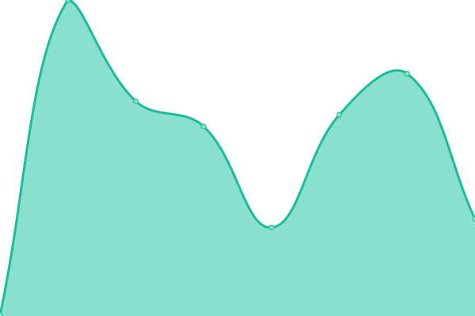
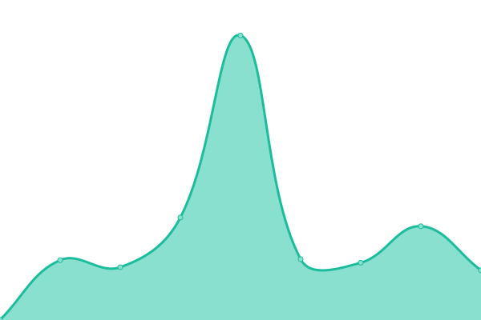

# [📈 Live Status](https://Cyclone-Bot-List.github.io/uptime): <!--live status--> **🟩 All systems operational**

This repository contains the open-source uptime monitor and status page for [Cyclone Bot List](https://cyclonebots.xyz), powered by [Upptime](https://github.com/upptime/upptime).

With [Upptime](https://upptime.js.org), you can get your own unlimited and free uptime monitor and status page, powered entirely by a GitHub repository. We use [Issues](https://github.com/Cyclone-Bot-List/uptime/issues) as incident reports, [Actions](https://github.com/Cyclone-Bot-List/uptime/actions) as uptime monitors, and [Pages](https://Cyclone-Bot-List.github.io/uptime) for the status page.

<!--start: status pages-->
<!-- This summary is generated by Upptime (https://github.com/upptime/upptime) -->
<!-- Do not edit this manually, your changes will be overwritten -->
<!-- prettier-ignore -->
| URL | Status | History | Response Time | Uptime |
| --- | ------ | ------- | ------------- | ------ |
|  [Google](https://www.google.com) | 🟩 Up | [google.yml](https://github.com/Cyclone-Bot-List/uptime/commits/HEAD/history/google.yml) | 

 117ms
     
 | 

<a href="https://Cyclone-Bot-List.github.io/uptime/history/google">100.00%</a>
    

|  [Wikipedia](https://en.wikipedia.org) | 🟩 Up | [wikipedia.yml](https://github.com/Cyclone-Bot-List/uptime/commits/HEAD/history/wikipedia.yml) | 

 138ms
     
 | 

<a href="https://Cyclone-Bot-List.github.io/uptime/history/wikipedia">100.00%</a>
    

|  [Hacker News](https://news.ycombinator.com) | 🟩 Up | [hacker-news.yml](https://github.com/Cyclone-Bot-List/uptime/commits/HEAD/history/hacker-news.yml) | 

 319ms
     
 | 

<a href="https://Cyclone-Bot-List.github.io/uptime/history/hacker-news">100.00%</a>
    

|  [Facebook](https://facebook.com) | 🟩 Up | [facebook.yml](https://github.com/Cyclone-Bot-List/uptime/commits/HEAD/history/facebook.yml) | 

 747ms
     
 | 

<a href="https://Cyclone-Bot-List.github.io/uptime/history/facebook">100.00%</a>
    

<!--end: status pages-->

[**Visit our status website →**](https://Cyclone-Bot-List.github.io/uptime)

## 📄 License

- Powered by: [Upptime](https://github.com/upptime/upptime)
- Code: [MIT](./LICENSE) © [Cyclone Bot List](https://cyclonebots.xyz)
- Data in the `./history` directory: [Open Database License](https://opendatacommons.org/licenses/odbl/1-0/)
